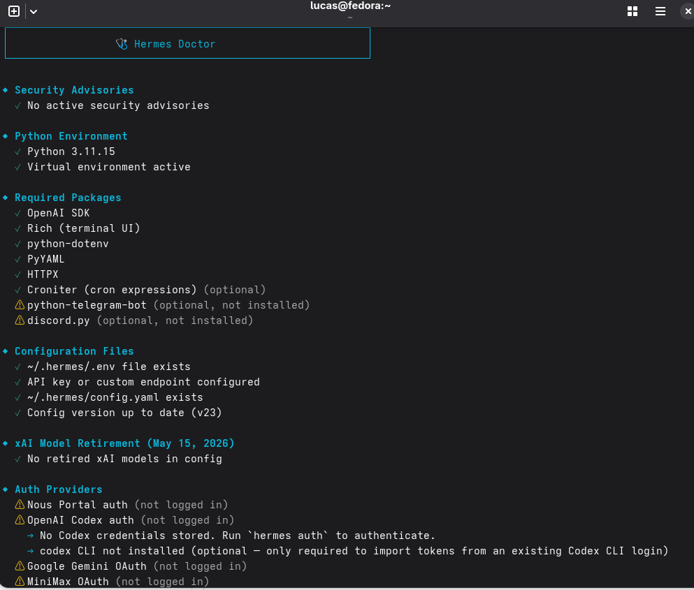
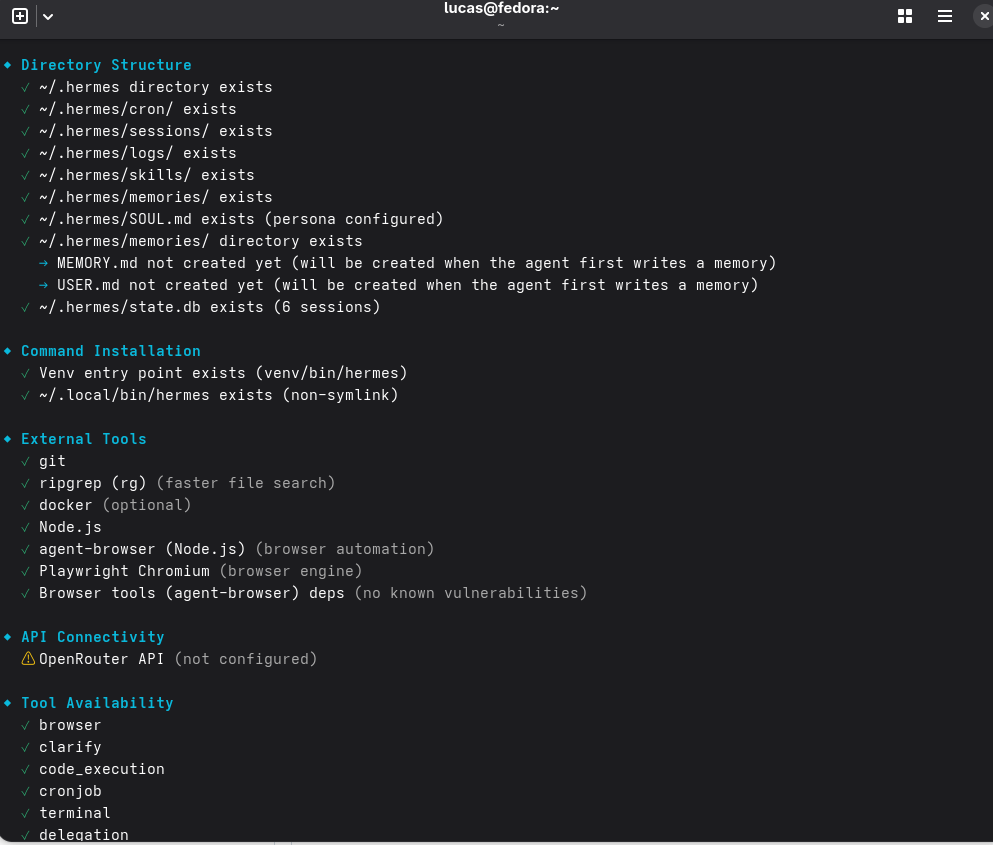
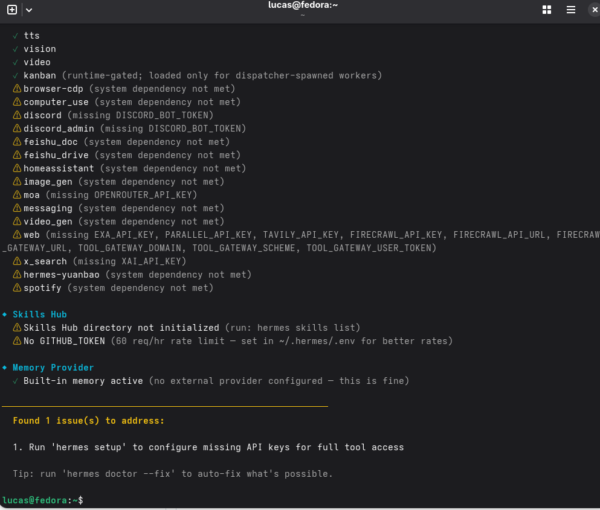
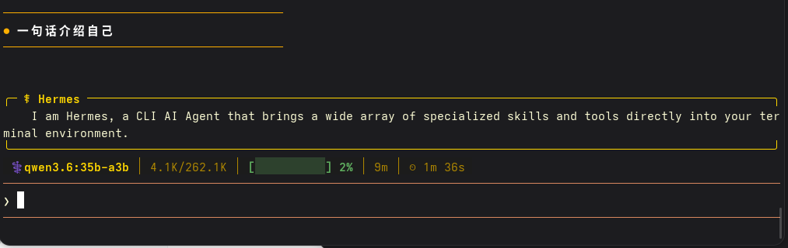

## Hermes 基础检查

- 安装方式：Linux
- Hermes 版本：v0.14.0 (2026.5.16)
- `hermes doctor` 结果：
  
- 模型 Provider：custom
- 模型名或 Custom endpoint：http://localhost:11434/v1
- CLI 对话是否成功：
- 配置目录或数据目录：/home/lucas/.hermes
- 遇到的问题：无
